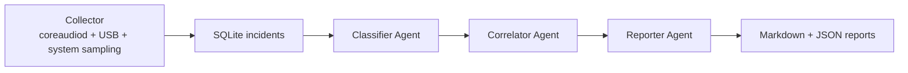

# AudioTriage

AudioTriage is a multi-agent pipeline that diagnoses Logic Pro dropouts by
correlating CoreAudio/system logs and writing human-readable incident reports.

## Status

This repository is being implemented with an OpenSpec change:
`openspec/changes/add-audiotriage`.

## Project Layout

```text
config/
  audiotriage.example.toml
src/
  audiotriage/
	 classifier/
	 collector/
	 correlator/
	 orchestrator/
	 reporter/
	 config.py
	 db.py
	 schema.sql
tests/
```

## Setup (uv)

1. Create a virtual environment and install dependencies:

	```bash
	uv venv
	source .venv/bin/activate
	uv pip install -e ".[dev]"
	```

2. Copy and edit configuration:

	```bash
	cp config/audiotriage.example.toml config/audiotriage.toml
	```

3. Set sensitive values via environment variables when possible:

	```bash
	export AUDIOTRIAGE_LLM_API_KEY="your-key"
	```

## Runbook (Short)

1. Install dev dependencies:

	```bash
	python3 -m venv .venv
	source .venv/bin/activate
	python -m pip install -e ".[dev]"
	```

2. Run full tests:

	```bash
	python -m pytest
	```

3. CLI sanity check:

	```bash
	audiotriage --help
	```

4. Real-session validation (for OpenSpec tasks 7.1-7.3):

	```bash
	# Terminal 1: run collector
	audiotriage run --config config/audiotriage.toml

	# Terminal 2: after reproducing an audio incident
	audiotriage report --config config/audiotriage.toml --since 2026-01-01T00:00:00
	audiotriage summary --config config/audiotriage.toml --week
	```

## Current Foundations

- Python project initialized with `pyproject.toml` and `src/` package layout
- SQLite schema bootstrap in `src/audiotriage/schema.sql`
- Settings loader in `src/audiotriage/config.py`

## Architecture



## What I Designed vs What AI Implemented

What I designed:
- Problem framing for diagnosing Logic Pro incidents from system evidence.
- Multi-agent stage design (collector, classifier, correlator, reporter).
- Incident taxonomy and expected outputs.

What AI implemented:
- Python package scaffolding and module boundaries.
- SQLite schema bootstrap and config loading.
- Collector, classifier, correlator, reporter, and orchestration code.
- CLI commands, launchd packaging template, and unit-test scaffolding.

## Sample Outputs

- Single incident sample: `examples/sample-incident-report.md`
- Weekly summary sample: `examples/sample-weekly-summary.md`

## Future Expansions

- Generalize this architecture to IoT device dropout triage.
- Adapt event correlation for OctoPrint reliability diagnostics.
- Apply the same root-cause pipeline to Apple TV streaming interruptions.

## Next Milestones

- Run end-to-end against a real Logic Pro session and verify incident quality.
- Calibrate trigger patterns and confidence threshold from live data.
- Capture one week of usage for a representative demo summary.
